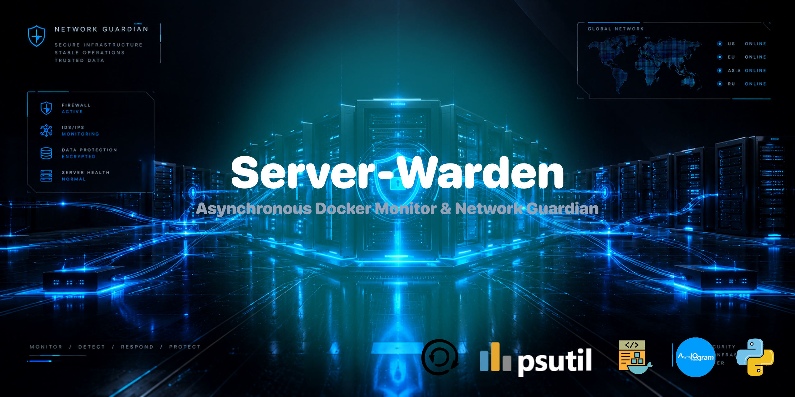

<p align="center"></p>

<div align="center">

# Server-Warden — Premium Asynchronous Server Infrastructure Monitor

</div>

An enterprise-grade infrastructure watchdog engine engineered using Python's modern asynchronous ecosystem. The system implements isolated worker threads and a decoupled architectural pattern to abstract Docker socket events and execute full system kernel networking audits without blocking core execution loops.

<div align="center">

## Features Grid

</div>

* **Asynchronous Engine Core:** Operates natively over `aiogram 3.x` and `asyncio` execution loops, allowing hundreds of metrics updates to process simultaneously.
* **Network Socket Audit:** Intercepts system port bindings (`psutil`) to identify global network threats, tracking open sockets directly back to their parent Docker applications.
* **Auto-Throttled Background Worker:** Runs background micro-tasks that check container conditions and verify database isolation rules once every 24 hours.
* **Perimeter Security Firewall:** Uses customized outer middleware blocks to check incoming traffic profiles and send real-time alerts about unauthorized access attempts.
* **Resource Resiliency Layers:** Uses selective error catches around disk-sensor reading actions to keep the dashboard responsive during unexpected mount drops.

<div align="center">

## Architecture Tree

</div>

```text
Server-Warden/
├── config/
│   └── config.py
├── handlers/
│   └── commands.py
├── keyboards/
│   └── reply.py
├── middlewares/
│   └── auth.py
├── services/
│   └── docker_mon.py
├── .gitignore
├── Dockerfile
├── LICENSE
├── README.md
├── banner.png
├── docker-compose.yml
├── main.py
└── requirements.txt
```

<div align="center">

## 📦 Local Deployment & Verification

</div>

1. Clone the Repository
```bash
git clone https://github.com/Hades-db/Server-Warden
```

2. Enter the workspace directory:
```bash
cd Server-Warden
```

3. Environment Configuration
Create a production configuration file named `.env` within the root framework directory:
```env
BOT_TOKEN=Bot_Father_Bot_TOKEN
ADMIN_ID=Ur_TG_ID
CHECK_INTERVAL=300
```

4. Local Automated Stack Deployment
```bash
docker compose up -d --build
```

5. Production Cluster Logs Verification
```bash
docker compose logs -f server_wallter
```
